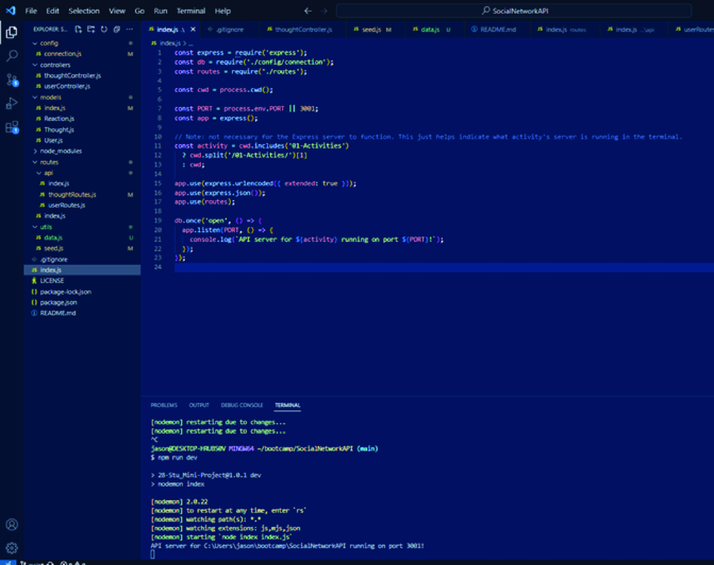
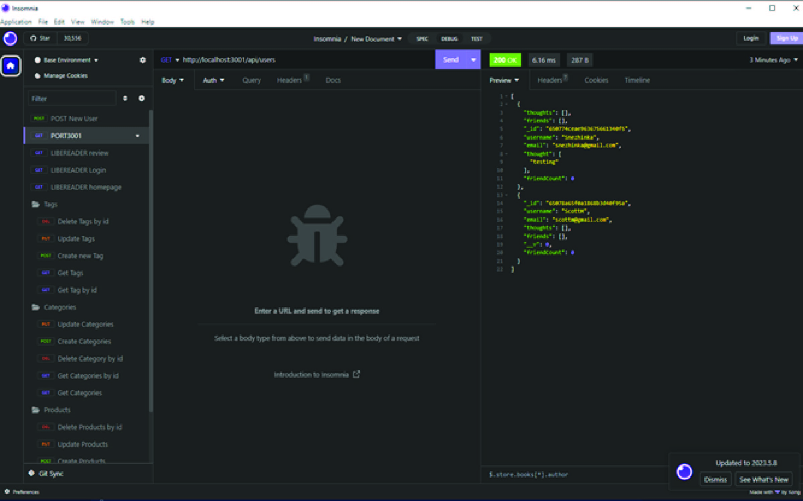
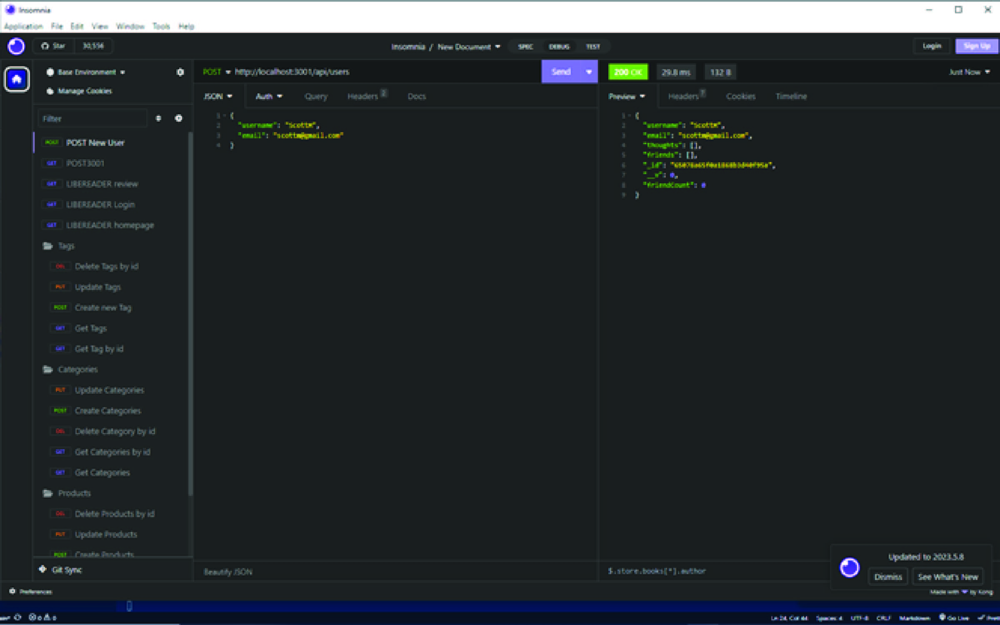
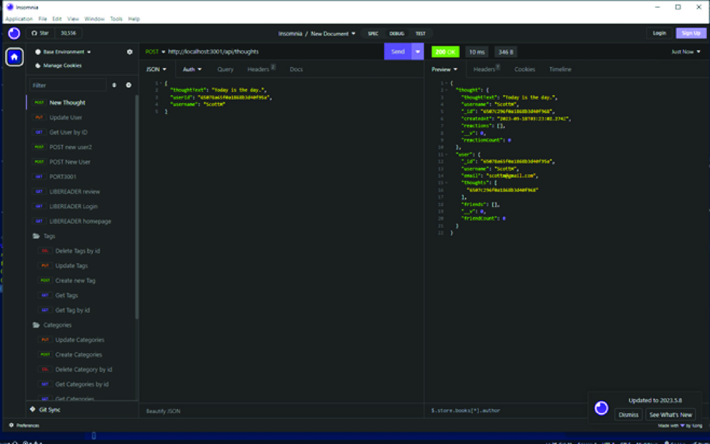
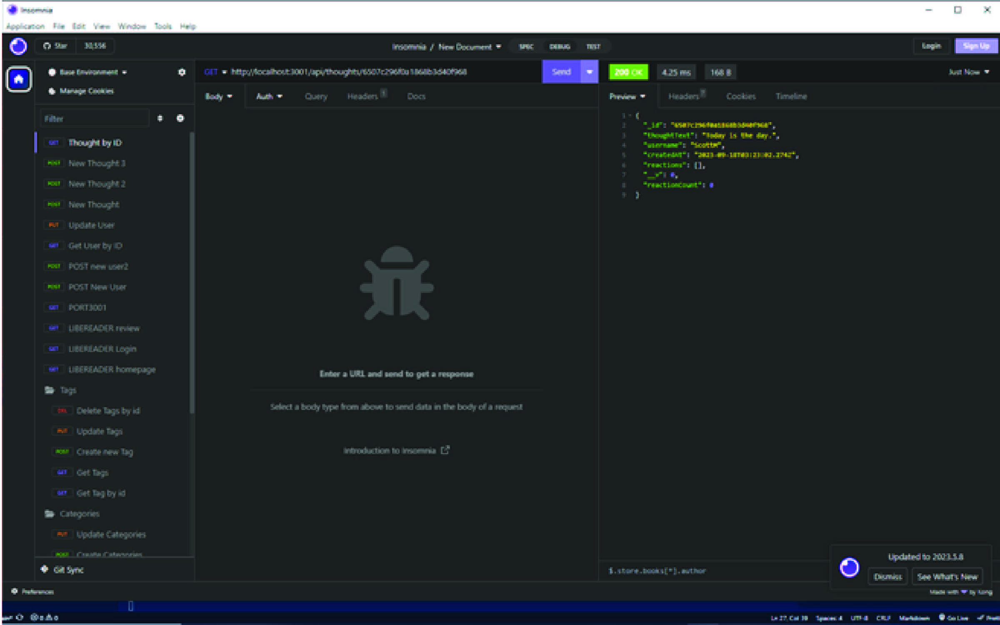

# SocialNetworkAPI

## Table of Contents

- [Description](#description)

- [Technologies-Used](#technologies-used)

- [License](#license)

- [Questions](#questions)

## Description

This work is intended as an example how a business could utilize a NoSQL database to handle large amounts of unstructured data.  It concentrates on the ease of use in creating, reading, updating, and deleting (CRUD) website users as well as maintaining their interactions with the webpage. THe interractions include post users thoughts, reactions to friends' thoughts, creating and updating or deleting friends from the list.

## Technologies Used

There are a few technologies that were utilized as bases for this project: Express.js, Node.js, JavaScript, MongoDB, and Mongoose, MongoDB Compass helped to visualize the data. Additionally, Insomnia application,was used to test the CRUD functionality.

## License

MIT License

## Contact

[Link to Github](https://github.com/anna071387)

